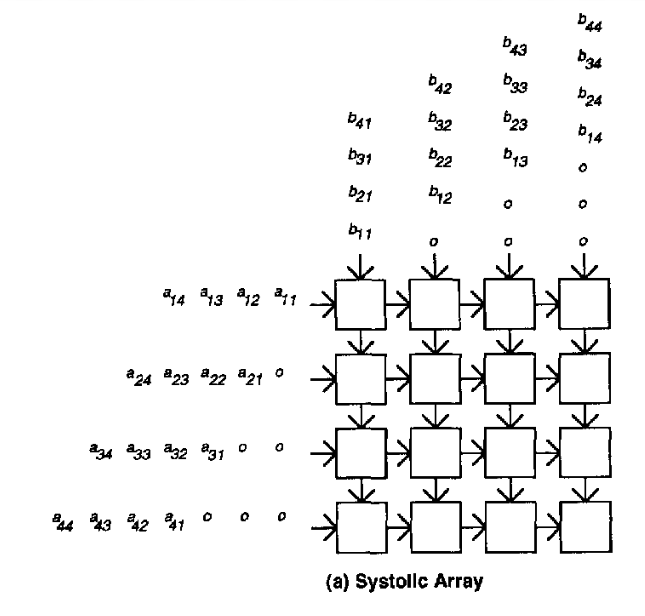
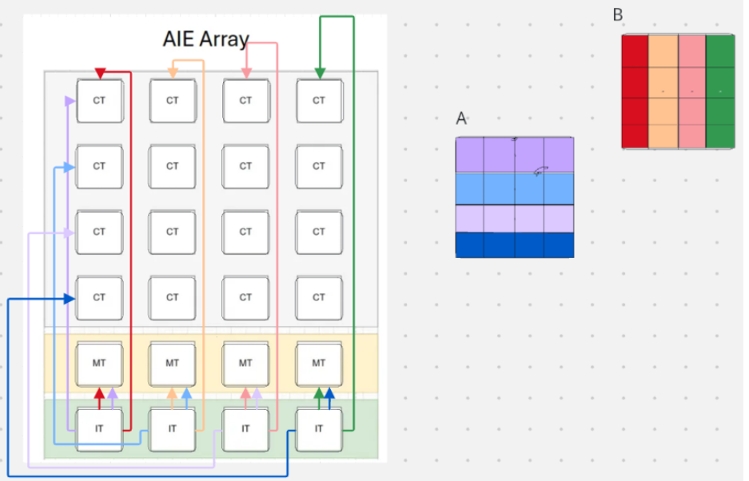

# Systolic Array Matrix Multiplication on Ryzen™ AI NPU

## 1. Problem Statement: Systolic Array Matrix Multiplication

A systolic array is a grid of processing elements (PEs) that compute matrix multiplication by passing partial results and input data through the array in a pipelined fashion. Each PE performs multiply-accumulate operations, propagating intermediate results to its neighbors.

**Goal:** Efficiently map a $M \times K$ by $K \times N$ matrix multiplication onto the NPU’s AIE array using a systolic architecture.
For starters we will design a systolic array architecture that is output stationary.


## 2. Mapping the Systolic Array onto the NPU

### Visual Architecture Mapping

For easy visual understandment we are going to walkthrough perfomring a 4x4 Matrix multiplication on the Systolic Array.
- Input data flow:
- **Systolic Array:**  
    
  
  The systolic array problem allows us to map a matrix that has the same width as the systolic array architecture (In this case 4).
  Here we can see the A matrix (M*K) is sliced up into 4 different buffers. 
  - We first take the first row of the A matrix say $(a/_11, a/_12, a/_13, a/_14) and build a buffer for these elements to begin "shifting their inputs in at Compute time = 1. We continue to do this for each row of A but for the folllowing buffers its (equation: at buffer n, computation start = 1+ Computation time (n-1)). Repeat for all the rows which have mapped to the systolic array of the 
  - Second We take the B matrix and follow the same pattern as what we have done for the A matrix above though we are slicing the B matrix into columns now and will feed the culumns into the top of the AIE Array 
  - 


- **NPU Mapping:**  
    
  Each AIE tile acts as a PE. Data flows horizontally and vertically using ObjectFIFOs and cascade connections.

---

## 3. Data Movement Setup with ObjectFIFOs

### Input Matrices

- **Matrix A:**  
  Use `object_fifo` to stream rows of A from host → shim tile → memory tile → compute tiles.
  - A_tiles = [(0, 2), (0, 3), (0, 4), (0, 5)]

- **Matrix B:**  
  Use `object_fifo` to stream columns of B from host → shim tile → memory tile → compute tiles.
  - B_tiles = [(0, 5), (1, 5), (2, 5), (3, 5)]

### Output Matrix

- **Matrix C:**  
  Use `object_fifo` to collect results from compute tiles → memory tile → shim tile → host.

### Example ObjectFIFO Setup

```python
of_inA = object_fifo("inA", ShimTile, MemTile, depth, a_ty)
of_inB = object_fifo("inB", ShimTile, MemTile, depth, b_ty)
memA = object_fifo("memA", MemTile, ComputeTiles, depth, a_tile_ty)
memB = object_fifo("memB", MemTile, ComputeTiles, depth, b_tile_ty)
memC = object_fifo("memC", ComputeTiles, MemTile, depth, c_tile_ty)
outC = object_fifo("outC", MemTile, ShimTile, depth, c_ty)
object_fifo_link(of_inA, memA)
object_fifo_link(of_inB, memB)
object_fifo_link(memC, outC)